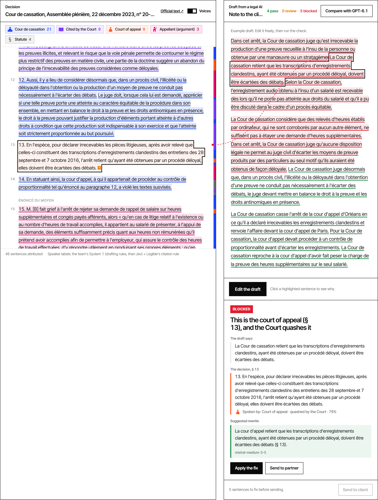
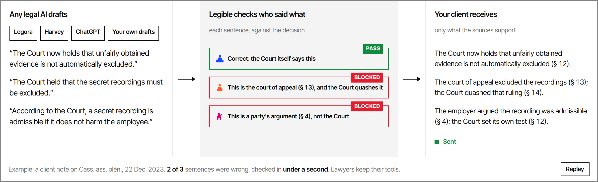

# Legible — who said it

**Legible checks who said what in legal AI drafts.**

A court decision speaks with several voices: the court itself, the lower court it reviews, the parties, the
case law it cites. AI drafting tools often mix them up. A typical slip is to write the court of appeal's
reasoning as the Supreme Court's ruling. Legible sits behind any legal AI (Legora, Harvey, ChatGPT or your
own model) and checks every sentence of a draft against the source before it reaches the client.



Demo film (30 s, silent): [`video/out/legible-30s.mp4`](video/out/legible-30s.mp4)

## How it works

1. **Map.** Every sentence of the decision gets a speaker and a status, with a probability. The speakers
   are the Court, the court of appeal, the appellant, the respondent, cited case law and statutes. The
   statuses are decides, alleges, quashed, approved and cites. Drafting rules settle what they can; a
   calibrated model (Jev, by TypeSafe) labels the rest.
2. **Trace.** Each sentence of the AI draft is matched to the paragraph it relies on.
3. **Check.** Fixed rules compare who the draft names with who actually speaks there. The result is
   pass, review or blocked, with the proof paragraph.
4. **Fix.** A blocked sentence comes back with a corrected version grounded in the source (Mistral).



## Results (small benchmark: 15 sentences, 2 decisions)

| System | Wrong verdicts, whole decision | Wrong verdicts, search excerpts | Source paragraph given |
|---|---|---|---|
| GPT-6.1 Sol | 0 | 2 (false alarms) | 5 / 15 |
| GPT-6 Astra | 0 | 1 (false alarm) | 5 / 15 |
| GPT-6 Luna | 2 (false alarms) | 3 (1 misattribution missed) | 0 / 15 |
| Mistral Medium 3.5 | 7 | 8 | 3 / 15 |
| **Legible** | **0** | n/a (maps the whole decision once) | **15 / 15** |

Details and raw answers are in `out_arret/`. The sentences are in `eval/` (9 misattributed, 6 correct).
Legora and Harvey have not been measured.

## Run it

```bash
pip install -r requirements.txt
cp .env.example .env              # TYPESAFE_API_KEY, MISTRAL_API_KEY (+ OPENAI_API_KEY for the benchmark)
python legible.py                 # rebuilds site/data.json
python -m uvicorn server:app --port 8766
```

Open http://localhost:8766: upload a decision, edit the draft, run the check.

Without a server, `site/` is a static demo: serve it with any static server, for example
`python -m http.server` run in `site/`.

## Layout

| Path | What |
|---|---|
| `site/` | The single-file site and its demo data |
| `server.py` | FastAPI live mode: `/api/analyze`, `/api/verify`, `/api/compare` |
| `legible.py` | Registry, status rules, verdicts, rewrites |
| `team_system1.py` | Adapter for the hackathon team's System 1 (a private package). Without it, `REGISTRY_SOURCE=placeholder` uses drafting rules + Jev |
| `bench.py`, `baseline_openai.py` | The benchmark above |
| `dossier_arret*/` | Demo decisions: Cass. ass. plén., 22 Dec 2023, n° 20-20.648 and Cass. civ. 2, 9 May 2018, n° 17-16.546 (public, Légifrance / Judilibre) |
| `pipeline/`, `run.py`, `dossier/`, `ui/` | First prototype: who says what across a fictional litigation file |
| `video/` | Demo films made with Remotion, built from real captures of the site (`capture_site.py`). The music track is not included; add your own as `video/public/music.mp3` |

## Status

Built in one day at the LLM × Law hackathon in Paris (October 2026). It works today on French
Cour de cassation decisions; full case files (pleadings, exhibits, expert reports) exist as a prototype.
The benchmark is small. Treat the numbers as a demonstration, not a measurement.
